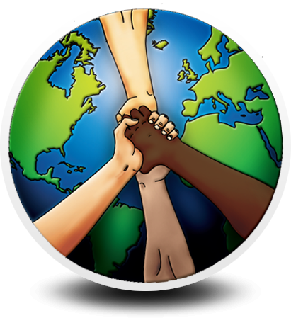
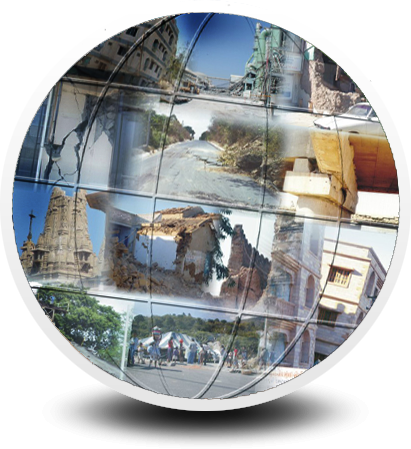
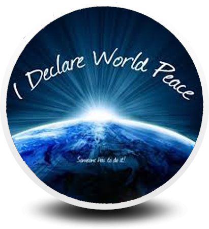

<!DOCTYPE html>
<html lang="en">
<head>
<link href="images/thumb.png" rel="icon" type="image/jpg">
<title>IT | For the peace</title>
<link rel="stylesheet" href="css/style.css" type="text/css">

</head>
<body id="page1">

  <!--==============================header=================================-->
  <header>
    

      

        

          <h1><a href="PEACE.html">peace</a></h1>
        

      

    

    

      

        

          <nav class="indent-left">
            <ul class="menu wrapper">
              <li class="active"><a href="PEACE.html">Home</a></li>
              <li><a href="howIct.html" class="style1">Technologies </a></li>
              <li><a href="Pillars of peace.html">Pillars of peace </a></li>
              <li><a href="ICT for peace.html">ict for peace</a></li>
              <li><a href="organisation.html">organisations</a></li>
            </ul>
          </nav>
        

      

    

    

      

        

          

            
  

            
  

            
  

          

        

      

    

  </header>
  <!--==============================content================================-->
  <section id="content">
  

    

      

        

          

            <h3>WORLD PEACE </h3>
            <em class="margin-bot text-1"><strong>&raquo; World peace is an ideal of freedom, 		                                    peace, and happiness among and within all nations and/or people. World peace is an idea of planetary                                    non-violence by which nations willingly cooperate, either voluntarily or by virtue of a system of                                    governance that prevents warfare. The term is sometimes used to refer to a cessation of all hostility                                    amongst all humanity. </strong></em>
            

              

                

                  

                    <figure class="img-indent2"></figure>
                    

                      

                        <h4 style="color:#FFFFFF;">Technology</h4>
                        
&nbsp;

                      

                    

                  

                  <a href="howIct.html" target="_blank" style="text-decoration:none; color:#333333;">
                  
<em>IT can contribute to many major fields such as in Education ,                              Jounalism , Media , Post-Conflict Reconstruction etc. which have a direct impact on the peace prevailing on                               the earth. 

                  </a>
                  
<a class="link-1" href="howIct.html">Know More</a>

                

              

              

                

                  

                    <figure class="img-indent2"></figure>
                    

                      

                        <h4 style="color:#FFFFFF;">PIllARS OF PEACE</h4>
                        
&nbsp;

                      

                    

                  

                  <a href="Pillars of peace.html" target="_blank" style="text-decoration:none; color:#333;"> 
                  
The Pillars of Peace provides a framework for assessing 
                    the positive peace factors that create peaceful societies. The 
                    taxonomy also forms an ideal base for measuring a society’s 
                    potential for peace. 

                  </a>
                  
<a class="link-1" href="Pillars of peace.html">Know More</a>

                

              

            

            

              

                

                  

                    <figure class="img-indent2"></figure>
                    

                      

                        <h4 style="color:#FFFFFF;">IcT for world peace</h4>
                      

                    

                  

                  <a href="ICT for peace.html" target="_blank" style="text-decoration:none; color:#333333;">
                  
Information and communication technologies can be used in peacemaking efforts in six different ways: 
                    By providing informations, Helping processing information , Imporving decision making, Reducing scarcity, Supporting relationships, Helping understand each other.  
                  

                  </a>
                  
<a class="link-1" href="ICT for peace.html">Know More</a>

                

              

              

                

                  

                    <figure class="img-indent2"></figure>
                    

                      

                        <h4 style="color:white;">organisation</h4>
                      

                    

                  

                  <a href="organisation.html" target="_blank" style="text-decoration:none; color:#333;">
                  
To maintain world peace many organisation have sprung-up in the technological world. These organisations strive hard to maintain world peace. Their contribution being less-effective than UNO are not entirely ignorable. Websites , blogs , online-donation camps support these organisaitons. 

                  </a>
                  
<a class="link-1" href="organisation.html">Know More</a>

                

              

            

          

        

        

          

            <h3>_____________________</h3>
            

              <figure class="img-indent"></figure>
              

                <h4 class="p1"> <a href="https://www.goodreads.com/author/show/47146.Albert_Schweitzer">Albert Schweitzer</a></h4>
                
“Until he extends the circle of his compassion to all living    things, man will not himself find peace.” 

              

            

            

              <figure class="img-indent"></figure>
              

                <h4 class="prev-indent-bot"><a title="view author" href="http://www.brainyquote.com/quotes/authors/r/ronald_reagan.html" onClick="aCl('topic','/quotes/topics/topic_peace','/quotes/authors/r/ronald_reagan','1')">Ronald Reagan</a></h4>
                
&quot;Peace is not absence of conflict, it is the ability to handle conflict by peaceful means.&quot;

              

            

          

          </article>
        

      

    

    

    </section>
  

</body>
</html>
